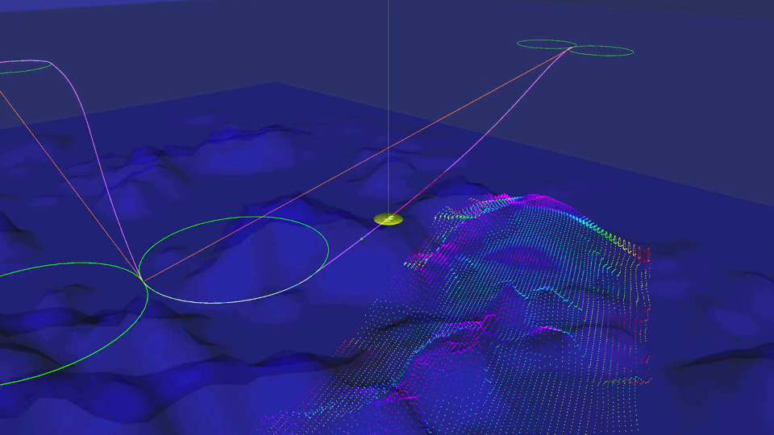

# [Plankton](https://www.liquid-tech.ai/)
Open source simulator for maritime robotics researchers



Plankton is an initiative aiming at simplifying robotics research in the maritime domain. 
It is a maritime environment simulator with an open source core, and a special focus on ease of use, stability, speed and sim to real. Its middleware of choice is ROS 2.

We intend to build a sustainable and open source core simulator for maritime robotics research. This core will support flexible specification of sensor suites and environmental conditions.

This project benefits from great open source advances in the simulation domain, mainly ROS, gazebo and its plugin uuvsimulator.

# Roadmap #
The first iteration of the projet is built from uuvsimulator and gazebo 9. We made uuvsimulator compatible with ROS2, and improved the performance (speed) of the simulator. After this first iteration, we will test different alternatives to gazebo 9, and choose the best simulation framework according to our users present and future needs.

We plan to release a beta version of uuvsimulator for ROS 2 in August, and a v1 in October.

# Contributing #
You can contribute by reporting bugs, proposing new features, improving documentation, contributing to code.
### Reporting bugs ###
Use our issue section on GitHub. Please check before that the issue is not already reported.
### Proposing new features ###
Please check first the list of feature requests. If it is not there and you think is a feature that might be interesting for users, please submit your request as a new issue.
### Improving documentation ###
If you feel something is missing in the documentation, please don't hesitate to open an issue to let us know. Even better, if you think you can improve it yourself, it would be a great contribution to the community!
### Contributing to code ###
So you are considering making a code contribution, great! We love to have contributions from the community.
Before starting hands-on on coding, please check out our issue board to see if we are already working on that, it would be a pity putting an effort into something just to discover that someone else was already working on that. In case of doubt or to discuss how to proceed, please contact one of us (or send an email to info@liquid-tech.ai).

# Installation #
Plankton currently relies (and has only been tested with) on **Ubuntu 18.04**, **ROS 2 Eloquent** and **Gazebo 9**, even if the package should work with later versions, considering some adjustments.

### 1. Install ROS 2 Eloquent 

If you don’t have ROS 2 eloquent installed, follow the instructions below and prefer to install the `ros-eloquent-desktop` package:
<https://index.ros.org/doc/ros2/Installation/Eloquent/Linux-Install-Debians/>

### 2. Install Gazebo 9

If you don't have Gazebo 9 installed, open a terminal and follow the steps below:

```
sudo sh -c 'echo "deb http://packages.osrfoundation.org/gazebo/ubuntu-stable `lsb_release -cs` main" > /etc/apt/sources.list.d/gazebo-stable.list'
```

`wget https://packages.osrfoundation.org/gazebo.key -O - | sudo apt-key add - `

`sudo apt-get update`

`sudo apt-get install gazebo9`

`sudo apt-get install libgazebo9-dev`

You can write `gazebo` in a terminal to make sure that gazebo runs correctly. Write `gazebo --version` to ensure that the version number is 9.X.

>For more information about the installation of Gazebo, refer to the official installation documentation (beware that the default installation command will not install the version 9): 
><http://gazebosim.org/tutorials?tut=install_ubuntu&cat=install>

### 3. Install the ros packages for gazebo

Write in a terminal:  
`sudo apt install ros-eloquent-gazebo-ros-pkgs`

>See <http://gazebosim.org/tutorials?tut=ros2_installing&cat=connect_ros> for more detailed information about gazebo and ROS 2 connection.

### 4. Build the Plankton plugin

If you don’t have a ROS 2 workspace yet, create a workspace that will contain your projects. In this installation guide, we choose an original name for this directory, `ros2_ws`:  
`mkdir -p ~/ros2_ws/src`

Move to the src directory:  
`cd ~/ros2_ws/src`

Make sure git is installed:  
`sudo apt install git`

Now, clone the Plankton repository:  
`git clone https://www.github.com/Liquid-ai/Plankton.git`

You need to source different files to configure ROS 2 and Gazebo environment variables. Write the following each time you start a new terminal to deal with ROS 2 / Gazebo stuff, or prefer to add them at the end of your .bashrc file. For the latter, don’t forget to source your .bashrc to enforce the update after saving these changes, or open a fresh terminal:  
`gedit ~/.bashrc`

For ROS 2 variables  
   - `source /opt/ros/eloquent/setup.bash`  
For your installation workspace (change the path accordingly)  
   - `source $HOME/ros2_ws/install/setup.bash`  
For Gazebo   
   - `source /usr/share/gazebo/setup.sh`

In order to download missing packages, install ROS dependency manager. Write the commands below in a terminal:  
```
sudo apt install python3-rosdep
sudo rosdep init
rosdep update
```

Browse to the root of your workspace and check for missing dependencies:  
```
cd ~/ros2_ws/
rosdep install -i --from-path src --rosdistro eloquent -y
```

Install Colcon, the build tool system:  
`sudo apt install python3-colcon-common-extensions`

Build the Plankton repository:  
`colcon build --packages-up-to plankton`

Now, install the XML / YAML frontend for launch files, which are missing in Eloquent:  
```
sudo apt install ros-eloquent-launch-xml    
sudo apt install ros-eloquent-launch-yaml
```

Next step is… No next step, you are already done!
If everything went well, you should be able to run example cases.

### 5. Test the package

Open a new terminal (don’t forget to source ROS 2 / Gazebo files if necessary) and write as below to open a gazebo world:  
`ros2 launch uuv_gazebo_worlds ocean_waves.launch`

Spawn the rexrov robot:  
`ros2 launch uuv_descriptions upload_rexrov.launch mode:=default x:=0 y:=0 z:=-20 namespace:=rexrov`

Add a joystick node to control it remotely:  
`roslaunch uuv_control_cascaded_pid joy_velocity.launch uuv_name:=rexrov model_name:=rexrov joy_id:=0`

Here, id represents the joystick id in your OS.You can determine what it your id by installing `sudo apt-get install jstest-gtk` and running it.

A more complete documentation of the uuv simulator features is available here:  
<https://uuvsimulator.github.io/>

Beware that the uuv documentation is written for ROS 1, so you will have to make adjustments on given commands to make it work in Plankton.

## FAQ

#### Logging and print information are not displayed in the terminal  
It is a problem affecting eloquent and launch files. Prefix your ros2 launch command with `stdbuf -o L`. If you are using python launch file, you can launch your node with the `emulate_tty` argument:    
```
Node(
    package='package_name',
    node_executable='package_exec',
    output='screen',
    emulate_tty=True,
)
```

#### The Gazebo worlds show a black screen when using virtual machine
Try to add the following line to your ~/.bashrc file     
`export LIBGL_ALWAYS_SOFTWARE=1`

# License #
Plankton is distributed under Apache License version 2.0 
